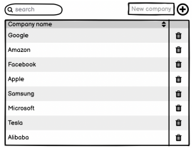

# Requirements

Your only technical requirements are React and Typescript. Do not use any other libraries or UI

kits. Tests are optional. You can use CRA to set things up, or your own custom build config

# Assignment

## Use cases

1. View company list

2. Add new company

3. Remove company

4. Search company

5. Sort company list

